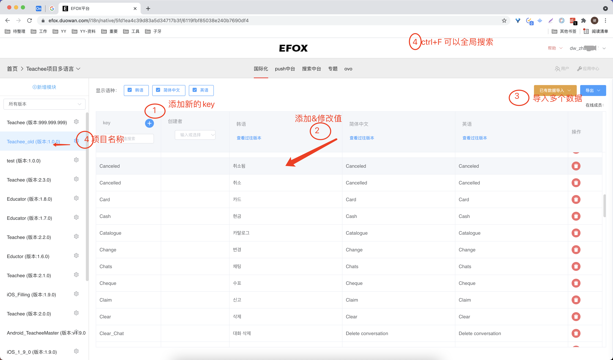

[toc]


# jekins打包地址

https://ci.duowan.com/jenkins2/job/GradleEfoxPlugin-android/

# 项目地址

https://git.duowan.com/apps/ai_edu/plugin/GradleEfoxPlugin-android


# EFOX 是什么

EFOX是大佬建议使用的一个统一多端国际化字符串的一个管理工具


# EFOX地址

https://efox.duowan.com/i18n/native/5fd1ea4c39d83a5d34717b3f/60e2d0be92f47a05a0bb15a7





1. 1⃣️添加一个新的key 
2. 2⃣️点击就可以修改值
3. 3⃣️ 可以导入多个数据（但必须对齐，否则失败）
4. 4⃣️项目名称


# 获取efox项目的地址

## 1. 点击项目左边的setting图像


## 2. 选择语言包地址


项目名称和国际化语言的前缀分别用到的地方

```
    efoxPaths = ["Teachee___999_999_999","Teachee_old___1_0_0"]
    valuesDir = ["values": "en", "values-ko": "ko"] //下载几种格式
```

其中"values" ， “values-ko”分别是AS项目中存放字符串的位置


# 项目接入

## 项目根目录build.gradle

```
buildscript {
    ext.kotlin_version = '1.4.20'
    repositories {
        maven { url 'http://repo.duowan.com:8181/nexus/content/groups/public' }
    }
    dependencies {
        ...
        classpath 'com.duowan.efox:efox-down:0.0.4'
    }
}
```

## commonres目录（插件应用目录）

```
apply plugin: com.duowan.efox.EfoxPlugin

efox {
    debugTask = false // 不显示额外的task（一般工具类）
    useLog = true //是否使用本地异常log收集
    urlFomat = "http://multi-lang.duowan.com/multiLangBig/Teachee/%s/%s" // 地址模版
    resName = "strings.xml" //通用的名称
    resPath = "src/main/res" // 该工程的这个路径下
    efoxPaths = ["Teachee___999_999_999","Teachee_old___1_0_0"]
    valuesDir = ["values": "en", "values-ko": "ko"] //下载几种格式

    patternKey = '^[a-zA-Z][0-9a-zA-Z_]+\$' // 根据这个正则过滤key(一般都是IOS上传)
    valueReplace = ["%@": "%s", "\\\'": "\'", "\\\"":"\""] // 特殊符号替换
}
```


## 点击grandle sync 生成task任务


## 生成的目录


其中这两个TASK是根据你配置的efoxPaths，生成多个TASK


## values 和 values-ko两个目录（以后会有更多个）


```
values
values-af
values-am
values-ar
values-as
values-az
values-b+sr+Latn
values-be
values-bg
values-bn
values-bs
values-ca
values-cs
values-da
values-de
values-el
values-en-rAU
values-en-rCA
values-en-rGB
values-en-rIN
values-en-rXC
values-es
values-es-rES
values-es-rUS
values-et
values-eu
values-fa
values-fi
values-fr
values-fr-rCA
values-gl
values-gu
values-h360dp-land-v13
values-h480dp-land-v13
values-h720dp-v13
values-hdpi-v4
values-hi
values-hr
values-hu
values-hy
values-id
values-in
values-is
values-it
values-iw
values-ja
values-ka
values-kk
values-km
values-kn
values-ko
values-ky
values-land
values-large-v4
values-ldltr-v21
values-lo
values-lt
values-lv
values-mk
values-ml
values-mn
values-mr
values-ms
values-my
values-nb
values-ne
values-night-v8
values-night-v29
values-nl
values-or
values-pa
values-pl
values-port
values-pt
values-pt-rBR
values-pt-rPT
values-ro
values-ru
values-si
values-sk
values-sl
values-small-v4
values-sq
values-sr
values-sv
values-sw
values-sw360dp-h560dp-v13
values-sw360dp-h620dp-v13
values-sw360dp-h640dp-v13
values-sw360dp-h680dp-v13
values-sw360dp-h720dp-v13
values-sw360dp-v13
values-sw520dp-v13
values-sw600dp-v13
values-sw720dp-v13
values-ta
values-te
values-th
values-tl
values-tr
values-uk
values-ur
values-uz
values-v16
values-v17
values-v18
values-v21
values-v22
values-v23
values-v24
values-v25
values-v26
values-v28
values-v29
values-vi
values-w360dp-port-v13
values-w480dp-port-v13
values-watch-v20
values-watch-v21
values-xlarge-v4
values-zh-rCN
values-zh-rHK
values-zh-rTW
values-zu
```


## efox参数介绍

| 参数名称     | 介绍                                                 |
| ------------ | ---------------------------------------------------- |
| debugTask    |                                                      |
| **urlFomat** | efox项目的地址                                       |
| resName      |                                                      |
| resPath      |                                                      |
| efoxPaths    | 添加项目，会生成不同的task                           |
| valuesDir    |                                                      |
| patternKey   | 正则表达式，过滤不符合规格字符串。（字母数字下划线） |
| valueReplace | 因为有IOS的原因，需要替换一些字符串                  |
|              |                                                      |


# 使用EFOX开发流程


## 多端合作


## 上传Efox

1. 打开efox网址（没有权限，找领导沟通）

https://efox.duowan.com/i18n/native/5fd1ea4c39d83a5d34717b3f/60e2d0be92f47a05a0bb15a7


2. 添加新的key

   


* 点击 1 会出现一个让添加的key， 输入key后， 生成新的行
* 点击相应的条目，输入进去（不仅可以新添加，也可以修改）


## 插件下载（下载字符串）


1. 点击相应的TASK， 自动下载 比如点击 [efox_Teachee__999_999] (如果本地没有文件，会自动创建文件)


因为有新增，所以log日志会打印出相应增加key-value

因为 useLog = true（是否使用本地异常log收集），会自动本模块的log.txt文件中。 这里不用担心文件太大传到git上，我已经添加到了忽略文件中。


如果有任何疑问，可以在这个文件中看看有没有答案.


# efox-down插件开发

## 项目地址

https://git.duowan.com/apps/ai_edu/plugin/GradleEfoxPlugin-android

## 如何修改插件

在buildSrc中进行开发

## 如何更改插件版本号

1. 将buildSrc中所有的代码复制到efox-down模块中

2. 修改publish_common.gradle的version


3. 上传到git
4. 通过jekins编译


# 日志

## 2021.10.15

问题： efox删除，但是本地还保留

解决：优先使用efox， 如果efox有key，就用

https://www.processon.com/diagraming/6168e893f346fb06a9eea982


## 测试用例

1. 增加一个key
2. 删除一个key
3. 修改key
4. 修改value


